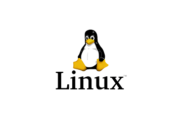
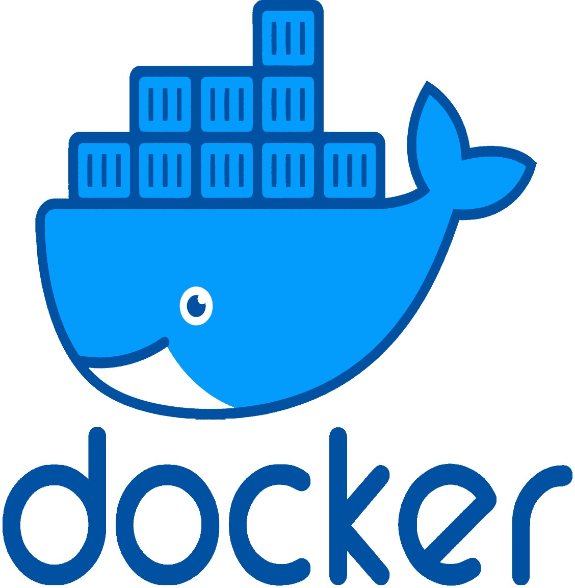
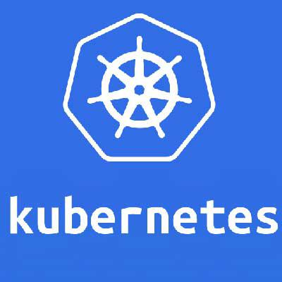
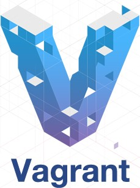
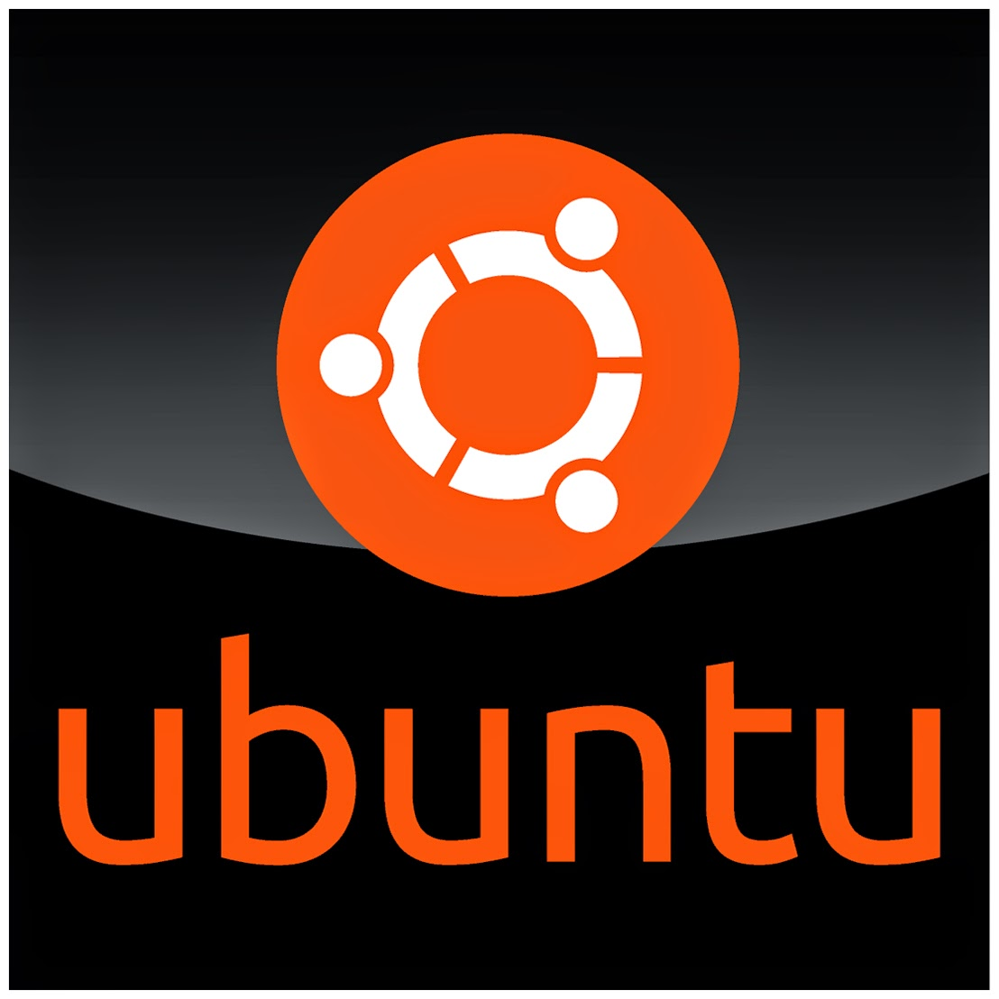
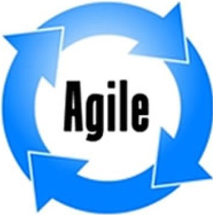
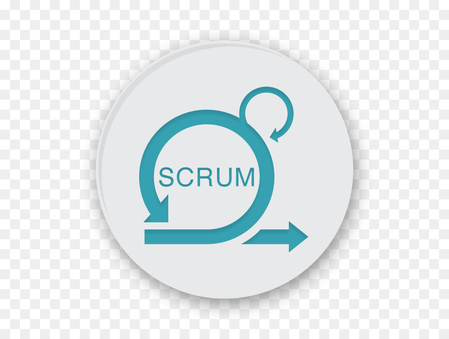
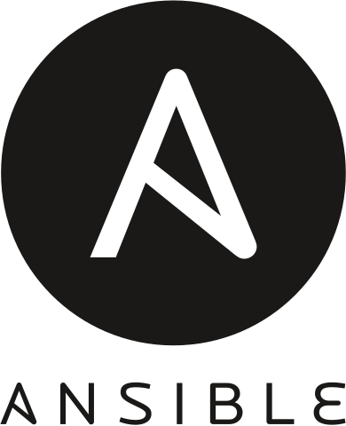
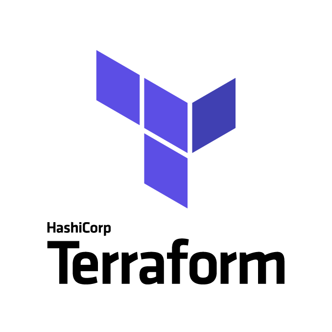
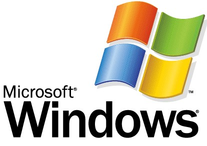

# 
**Welcome to my GitHub page!**

[

    ](https://www.linkedin.com/in/lee-hall-833b8419b/)

Currently working towards AWS Cloud Practitioner Certification 

## 
**Technical Skills and Experience**

<!--
**LeeHall-DevOps/LeeHall-DevOps** is a ✨ _special_ ✨ repository because its `README.md` (this file) appears on your GitHub profile.

Here are some ideas to get you started:

- 🔭 I’m currently working on ...
- 🌱 I’m currently learning ...
- 👯 I’m looking to collaborate on ...
- 🤔 I’m looking for help with ...
- 💬 Ask me about ...

- 😄 Pronouns: ...
- ⚡ Fun fact: ...
-->
